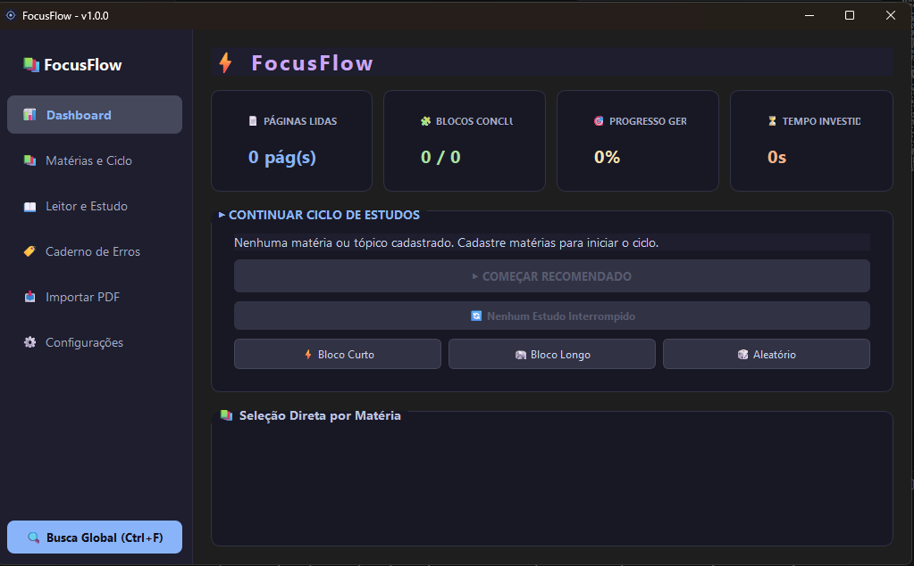
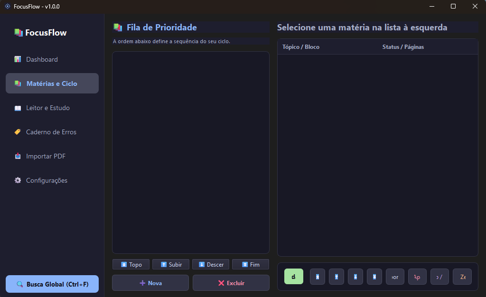
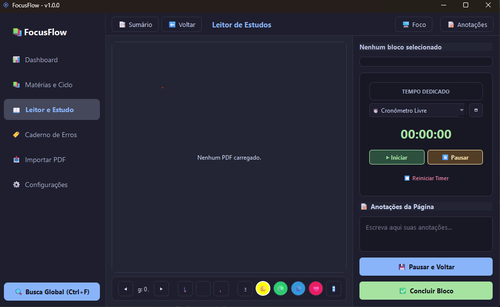
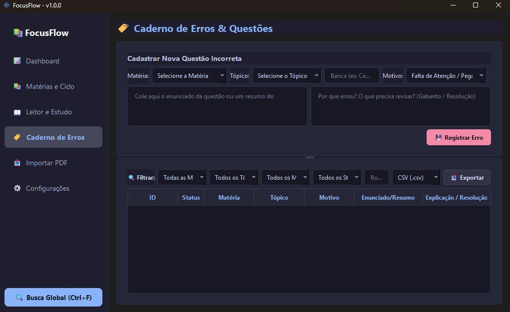

# 🎯 FocusFlow

> Um aplicativo desktop moderno, modular e inteligente para gerenciamento de ciclos de estudos e leitura ativa de PDFs.

[](https://www.python.org/)
[](https://pyside.org/)
[](https://www.sqlalchemy.org/)
[](LICENSE)


---

## 💻 Download e Instalação Rápida (Para Usuários)

Não é desenvolvedor ou não quer configurar o ambiente Python? Sem problemas! Baixe o aplicativo pronto para uso no seu sistema operacional:

<div align="center">

[](https://github.com/dev-ansu/focusflow/releases/download/v1.0.3/FocusFlow-Windows.zip)
&nbsp;&nbsp;&nbsp;&nbsp;
[](https://github.com/dev-ansu/focusflow/releases/download/v1.0.3/FocusFlow-Linux.tar.gz)

</div>

> 📌 **Como executar:**
> * **Windows:** Baixe o arquivo `.zip`, extraia o conteúdo em uma pasta e dê dois cliques em `FocusFlow.exe`.
> * **Linux:** Baixe o arquivo `.tar.gz`, extraia a pasta e execute o binário `FocusFlow`.

---

---

## 📌 Sobre o Projeto

O **FocusFlow** foi projetado para estudantes, concurseiros e pesquisadores que buscam maximizar o rendimento nos estudos. Unindo um **algoritmo de rotação de matérias** a um **leitor de PDF integrado com ferramentas de estudo ativo**, o aplicativo automatiza o planejamento e elimina a fadiga de ter que decidir "o que estudar agora".

---

## ✨ Principais Funcionalidades

### 🔄 Ciclo Inteligente de Estudos
- **Algoritmo de Rotação Automática:** Seleciona o próximo bloco/matéria com base em pendências, menor contagem de blocos concluídos e alternância de temas para evitar fadiga cognitiva.
- **Cronômetro e Pomodoro Integrados:** Controle preciso de tempo gasto por bloco de estudo.

### 📚 Leitor de PDF Integrado & Extração Automática (TOC)
- **Detecção Inteligente de Sumários (3 Camadas):** Leitura de bookmarks nativos, parsing via Expressões Regulares (Regex) e fallback automático para blocos padronizados.
- **Estudo Ativo:** Suporte a *highlights* (grifos de texto sem duplicação gráfica) e anotações vinculadas diretamente às coordenadas das páginas.

### 📝 Caderno de Erros & Revisão
- **Registro de Questões e Falhas:** Catalogação de tópicos que precisam de reforço.
- **Exportação Multi-formato:** Exporte suas anotações e caderno de erros em `CSV`, `JSON` e `TXT` para integração com outras ferramentas (como Anki).

### ⚙️ Segurança e Infraestrutura
- **Migrações de Banco Automáticas:** Atualizações transparentes no SQLite local sem perda de dados do usuário.
- **Sistema de Backup Local:** Backup automático e restauração segura das suas bases de dados e arquivos marcados.

---

## 🛠️ Tecnologias Utilizadas

- **Linguagem:** [Python 3.10+](https://www.python.org/)
- **Interface Gráfica (GUI):** [PySide6 (Qt for Python)](https://wiki.qt.io/Qt_for_Python)
- **Manipulação de PDF:** [PyMuPDF (fitz)](https://pymupdf.readthedocs.io/)
- **ORMs e Banco de Dados:** [SQLAlchemy](https://www.sqlalchemy.org/) + [SQLite](https://www.sqlite.org/)
- **Testes:** [Pytest](https://docs.pytest.org/)

---

## 📸 Demonstração e Funcionalidades

<div align="center">
  <!-- Imagem Principal / Dashboard -->
  
</div>

<br />

### 🔄 Matérias & Ciclo
<div align="center">
  
</div>


### 📚 Leitor de PDF Integrado & Extração Automática
<div align="center">
  
</div>
<div align="center">
  
</div>

### 📝 Caderno de Erros & Exportação
<div align="center">
  
</div>


## 🚀 Como Executar o Projeto

### Pré-requisitos
- Python 3.10 ou superior instalado na máquina.
- Git instalado.

### Passo a Passo

1. **Clone o repositório:**
   ```bash
   git clone [https://github.com/dev-ansu/focusflow.git](https://github.com/dev-ansu/focusflow.git)
   cd focusflow

2. Crie e ative um ambiente virtual (venv):
    # Windows
        python -m venv venv
        .\venv\Scripts\activate

    # Linux / macOS
        python3 -m venv venv
        source venv/bin/activate

3. Instale as dependências:
    pip install -r requirements.txt

4. Execute a aplicação:

    python3 main.py

🤝 Contribuição
    Contribuições são super bem-vindas! Se você tiver sugestões de melhorias, relatórios de bugs ou novas funcionalidades:

    1. Faça um Fork do projeto.

    2. Crie uma Branch para a sua Feature (git checkout -b feature/IncrívelFeature).

    3. Faça o Commit das suas alterações (git commit -m 'Add: IncrívelFeature').

    4. Faça o Push para a Branch (git push origin feature/IncrívelFeature).

    5. Abra um Pull Request.
